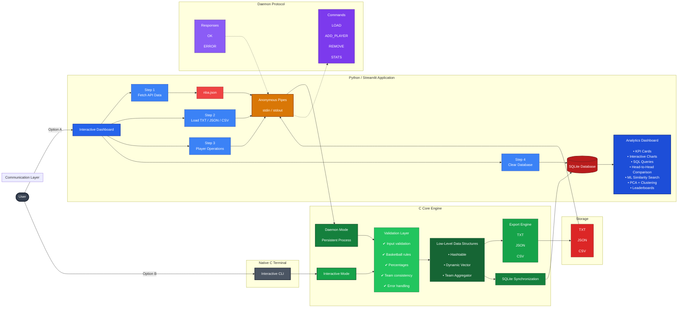

# Basket Stats Manager


## Overview
Basket Stats Manager is a full-stack basketball analytics platform that combines a high-performance C engine, persistent SQLite storage, an interactive Streamlit dashboard and machine learning techniques to analyze, manage and visualize player statistics from multiple data sources.

## Table of Contents
- [Overview](#overview)
- [Full-Stack Pipeline](#the-full-stack-pipeline)
- [Key Features](#key-features)
- [Project Architecture](#project-architecture)
- [System Architecture](#system-architecture)
- [Why Daemon Mode?](#why-daemon-mode)
- [Communication Protocol](#communication-protocol)
- [Technologies Used](#technologies-used)
- [Prerequisites](#prerequisites)
- [Build](#build-the-project)
- [Execution](#execution)


## The Full-Stack Pipeline

* **Backend (C)**: Uses custom Hashtables and Vectors for $O(1)$ performance. Operates in a persistent `--daemon` mode to avoid loading overhead.

* **Persistence (SQL)**: Every operation is ACID-compliant, ensuring data integrity between the C memory structures and the physical database.

* **Frontend (Python)**: An interactive GUI that bridges the gap between raw stats and Data Science, offering real-time filtering and ML insights.

## Key Features

- **Hybrid Storage**: Concurrent export to .txt, .json, .csv, and a persistent SQLite .db file.

- **Relational Data Management**: Utilizes SQL Transactions for lightning-fast database updates.

- **Advanced Player Analytics**: Tracks 12+ statistical categories, including custom-calculated shooting percentages and defensive impact.

- **Memory Safe**: Zero memory leaks (Valgrind tested), ensuring stability in high-performance environments.

- **AI Scouting & Clustering**: ML-powered player similarity engine and archetype grouping using K-Means and PCA.

- **Daemon-Based Communication**: The C engine runs as a background process, accepting commands via pipe (LOAD, ADD_PLAYER, STATS).

## Project Architecture

The project follows a standard, modular C architecture, separating declarations from implementations:

```text
basket-stats/
├── .github/workflows/      # CI/CD pipelines
│   └── c-build.yml         # GitHub Actions automated build testing
├── analytics/              # Data visualization and Web GUI (Python)
│   ├── app.py              # Streamlit Web Application (Interactive Dashboard)
│   ├── players.csv         # Exported data file from the C backend
│   └── nba.csv             # Exported real NBA data
├── database/               # Relational Storage
│   └── nba_stats.db        # SQLite database generated by the C backend
├── include/                # Header files (.h) - Data structures and APIs
│   ├── hashtable.h         # Hashtable definitions
│   ├── vector.h            # Vector definitions
│   ├── json_parser.h       # Custom JSON parsing API
│   └── ...                 # Core entity and utility headers
├── run/                    # Build and Execution directory
│   ├── Makefile            # Build automation for the C program
│   └── run.sh              # Bash script for execution and Valgrind memory checks
├── src/                    # Source files (.c) - Core logic and implementations
│   ├── main.c              # Application entry point
│   ├── hashtable.c         # Custom Hashtable logic (O(1) lookups)
│   ├── vector.c            # Dynamic array logic
│   └── ...                 # Logic for menus, file ops, and statistics
├── tests/                  # API integrations and mock data
│   ├── fetch_nba.py        # Python script to fetch real-time data from the NBA API
│   ├── nba.json            # Real NBA player data formatted for the C parser
│   └── new.txt             # Mock data for robustness testing
├── .gitignore              # Ignored files for version control
├── LICENSE                 # Project license
└── README.md               # Project documentation
```


##  System Architecture
The application is built around a persistent C daemon responsible for data management, synchronization and communication between all system components.



## Why Daemon Mode?

Instead of launching a new C process for every frontend request, the backend remains alive as a daemon.

Benefits include:

- Faster response times.
- Reduced process creation overhead.
- Persistent in-memory data structures.
- Better scalability for interactive applications.

## Communication Protocol

The frontend communicates with the C backend through a lightweight text-based command protocol over standard input/output pipes.

Supported commands:

| Command | Syntax | Purpose |
|----------|--------|---------|
| **LOAD** | `LOAD <type> <filepath>` | Import players from TXT or JSON files. |
| **ADD_PLAYER** | `ADD_PLAYER <name>` | Create a new player. |
| **REMOVE_PLAYER** | `REMOVE_PLAYER <name>` | Remove an existing player. |
| **STATS** | `STATS <name> <stat> <value>` | Update player statistics. |
| **EXPORT** | `EXPORT <format> <filepath>` | Export the current dataset. |
| **EXIT** | `EXIT` | Gracefully terminate the daemon. |

> **Protocol format**

```text
COMMAND|ARG1|ARG2|...
```

Example:

```text
LOAD|json|tests/nba.json
ADD_PLAYER|Stephen Curry
STATS|Stephen Curry|PTS|35
EXPORT|csv|analytics/players.csv
EXIT
```

The protocol was intentionally designed to remain human-readable, extensible, and independent from the graphical frontend.

## Technologies Used

| Layer | Technologies |
|--------|--------------|
| Backend | C17 |
| Data Structures | Custom Hashtable, Dynamic Vector |
| Database | SQLite3 |
| Frontend | Python, Streamlit |
| Visualization | Plotly, Matplotlib |
| Machine Learning | Scikit-Learn, PCA, K-Means, Cosine Similarity |
| Build System | Make |
| Memory Analysis | Valgrind |
| CI/CD | GitHub Actions |

## Prerequisites

Make sure you have gcc and make installed on your system.
For memory leak checking, you will also need valgrind.
```Bash
# Ubuntu/Debian
sudo apt update
sudo apt install build-essential valgrind
```

## Build the Project

The project uses a Makefile that automatically handles dependencies (.d files) and compiles the object files efficiently.

### 1. Clone the repository
```Bash
git clone [https://github.com/Spyrosmaicho/basket-stats.git](https://github.com/Spyrosmaicho/basket-stats.git)
```

### 2. Navigate to the directory
```Bash
cd basket-stats/run
```
### 3. Compile the project
```Bash
make
```
## Execution

You can run the executable directly or use the provided shell script for memory checking(make sure you are still inside the run/ folder) to process data and sync it with the SQLite database:

### Run the application directly
```Bash
./basket
```

### OR use the shell script (runs the app through Valgrind)
```Bash
./run.sh
```

To clean the compiled object files, simply run the following instruction inside the `run/` directory:
```Bash
make clean
```
### Multi-League Data Engine

The project features a sophisticated data fetching system (`fetch_nba.py`) that bridges the gap between raw web APIs and the C backend.
#### Dynamic Roster Generation

The engine now includes a curated database of 100 elite Euroleague players and real-time integration with the NBA API (Ensure you have the API library installed: `pip install nba_api`). When running the fetch script, you can choose between three modes:

- **NBA Only**: Fetches the top 50 performers from the current NBA season.

- **Euroleague Only**: Randomly selects 25 players from the curated 100-player Euroleague database to ensure a dynamic experience every time.

- **Mixed Mode**: Generates a hybrid roster of 25 NBA stars and 25 random Euroleague stars, allowing for cross-continental statistical comparisons.

#### Execution:
```Bash
# Navigate to the tests folder
cd tests
# Run the fetch script
python3 fetch_nba.py
```
This generates `nba.json`, which can be imported directly into the C application.

### Data Analytics Web Dashboard & NBA API

This project goes beyond a simple C backend by providing a full end-to-end data pipeline. It features a modern, interactive Web Dashboard built with Python, and the ability to fetch real-world data directly from the NBA.

#### Launching the Web Dashboard

The C application exports the memory-stored data into a clean CSV format. You can use the included Python Web Dashboard to interact with this data visually.

**Requirements**:

Export your data from the C application and ensure it is saved as players.csv (or nba.csv) inside the analytics/ folder.

**Installation & Execution**:

Ensure you have the required Python libraries for the GUI and interactive charts:
```Bash
pip install streamlit pandas matplotlib numpy plotly scikit-learn
```
Then, navigate to the analytics folder and start the Streamlit server:
```Bash
cd analytics
streamlit run app.py
```
This will automatically open a local web page in your default browser featuring:

- **Season Highlights (KPIs)**: Instant top-level metrics calculating the Top Scorer, Best Playmaker, and Defensive Anchor of the loaded roster.

- **Interactive Plotly Charts**: Select and view advanced metrics. Hover over data points to see details, zoom in, and analyze Player Profiles (Radar Charts), Playmaking Efficiency, and True Shooting %.

- **Advanced Database Queries**: Use live UI sliders to filter the entire roster based on multiple statistical categories (Points, Rebounds, Assists, Steals, Percentages). Includes a one-click CSV download for the filtered results.

- **Pro Head-to-Head Cards**: Compare two players side-by-side with conditional color-coded formatting to instantly see who wins in each statistical category.

- **AI Scouting & Clustering (Machine Learning)**: An advanced ML pipeline built with `scikit-learn`. Features a **Player Similarity Engine** (using Cosine Similarity) to find statistical "twins" across the league, and **Archetype Clustering** (using PCA dimensionality reduction and K-Means) to automatically group players into distinct playstyles on an interactive 2D scatter plot.

- **Leaderboard**: A dedicated ranking system that identifies the Top 5 performers in key categories: Scoring, Playmaking (Assists), and Defensive Impact (Steals + Blocks).